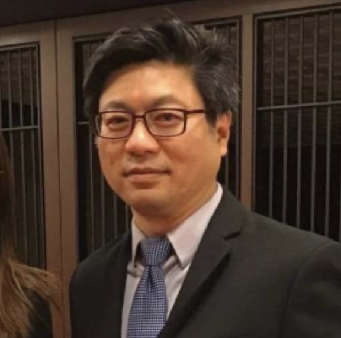
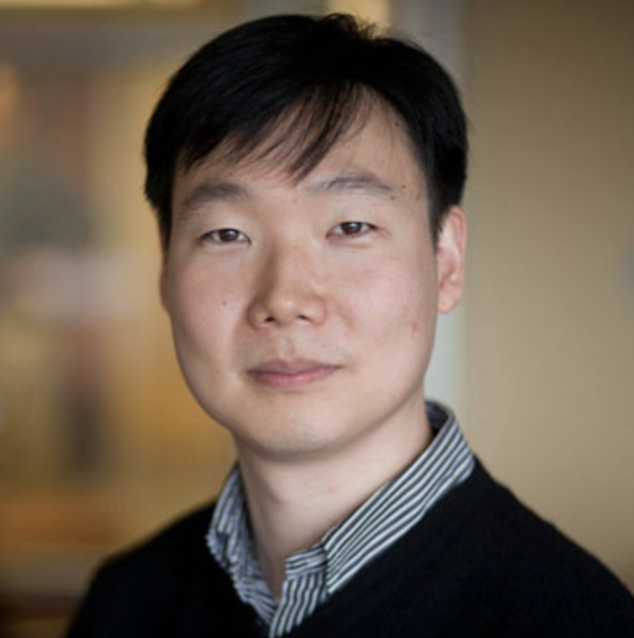

# Tutorial: (RL4CAS) Reinforcement Learning for Computer Architecture and Systems Research

## Abstract
**Motivation:** Reinforcement learning has been demonstrated as a powerful and promising tool in many scientific and gaming problems. Recently, RL has shown promising results to solve problems in the area of computer architecture and compiler. Nevertheless, the lack of an easily accessible reinforcement learning framework and tutorial has prevented its full potential in solving architectural, security, and optimization problems. 

**This Tutorial:** We aim to make RL accessible to computer architecture and system researchers, lowering the barrier for researchers to use RL in their own domain specific problems. The tutorial will be a combination of lectures/talks and hands-on labs. We will use our recent research artifacts as an example to demonstrate the effectiveness of RL in computer architecture and system research.

First, we will give a general introduction on the foundations of RL, in which we explain the RL concept, the RL environment (gym), and a RL training framework. Then we will discuss the application of RL in computer systems. The first example is [CompilerGym](https://compilergym.com/), which improves the performance of code using RL-curated compiler flags. The second example is [AutoCAT](https://github.com/facebookresearch/AutoCAT), where the RL agent is used to explore the potential cache-timing attacks. We will provide the detailed RL formulation, the example code and a lab section to give the audience hands-on experience on how to solve a computer system problem using RL. Below is the tentative schedule for the tutorial.

**Target Audience:** The target audience include but not limited to computer architecture and systems (attending ISCA, and other conference attendees at FCRC) researchers who are interested in machine learning methods and their applications in architecture and systems, applied machine learning researchers who are exploring new applications of machine learning in domain-specific problems. Graduate and undergraduate students who are interested in computer systems and machine learning in general are especially suitable for this tutorial as the tutorial provides hands-on coding experience with RL.

**Expected Outcome:** This tutorial will create concrete examples and hands on experience to the audience on how to formulate a computer architecture and system problem as an RL problem, and run RL training. We hope the attendance will proactively use RL in their own research problems after the tutorial.

## This tutorial
The inaugural `RL4CAS` tutorial will be held at [ISCA 2023](https://www.iscaconf.org/isca2023/) in Orlando on  Saturaday, June 17th, 2023, 9am-12:30pm. We will also enable livestream by Zoom. The speakers include Yuandong Tian, Chris Cummins, Vincent Moens, Mulong Luo and Wenjie Xiong.

| Time  | Topic | Speaker(s) |
| ------------- | :-------------: | :-------: |
| 9:00-9:05a | Welcoming Remarks | |
| 9:05-9:40a | Introduction to RL and its applications to systems | [Yuandong Tian](https://yuandong-tian.com), Meta AI |
| 9:40-10:15a | CompilerGym: RL for compiler optimization | [Chris Cummins](https://ai.facebook.com/people/chris-cummins/), Meta AI |
| 10:15-10:45a | RL for computer architecture and security  | [Wenjie Xiong](https://computing.ece.vt.edu/~wenjiex/), Virginia Tech |
| 10:45-11:00a| Introduction to [TorchRL](http://github.com/pytorch/rl), an easily accessible RL framework|[Vincent Moens](https://www.linkedin.com/in/vincent-moens-9bb91972/?originalSubdomain=uk), Meta AI |
| 11:00-11:20a | Coffee Break| |
| 11:20-12:30a | Lab: hands on with RL for system using TorchRL |   [Mulong Luo](https://mulongluo.me), Cornell and [Vincent Moens](https://www.linkedin.com/in/vincent-moens-9bb91972/?originalSubdomain=uk), Meta AI |

Stay tuned for more information!

## Zoom access ##

The zoom link for the event livestream will be provided here on the day of the tutorial.

## Contact us
For any further questions please contact <ml2558@cornell.edu>

## About us

|  |  Organizer |
| ------------- | :------------- | 
|  | **Mulong Luo** (Cornell) currently a final-year Ph.D. candidate at Cornell University advised by Prof. Edward Suh. His research interests are in computer architecture, side channel, and machine learning. His work has been shortlisted for Top Picks in Hardware and Embedded Security, and he has also won best paper award at CPS-SPC workshop.|
|  | **Wenjie Xiong** (Virginia Tech) is an assistant professor at Virginia Tech. Her research interests are in computer architecture and hardware security. Her work was selected as an Honorable Mention of IEEE Micro Top Picks 2021 and the featured paper of IEEE Transactions on Computers (TC).|
|  | **Yuandong Tian** (Meta AI) is a research scientist and senior manager in Meta AI Research, working on reinforcement learning, representation learning and optimization. He is the first-author recipient of 2021 ICML Outstanding Paper Honorable Mentions and 2013 ICCV Marr Prize Honorable Mentions, and is the lead scientist and engineer for the OpenGo project. He also received the 2022 CGO Distinguished Paper Award.|
|  | **Hsien-Hsin Sean Lee** (Intel) is an Intel Fellow leading the heterogeneous system technologies team in the Software and Advanced Technology Group where he focuses on the inter-domain innovation and co-optimization across computer architecture, middleware, machine learning, and semiconductor technologies. He is a Fellow of the IEEE.|
|  | **G. Edward Suh** (Cornell/Meta AI) is a professor of ECE at Cornell University and a Research Scientist at Meta AI. His research interests include computer systems in general with particular focus on computer architecture and security. His current research focuses on building secure computing systems for secure and private machine learning, and using machine learning to improve the security of computer systems. His past work on the AEGIS secure processor is recognized with the test of time award by Intel for its contribution for trusted execution environments deployed across the industry today. He is a Fellow of IEEE.| 
