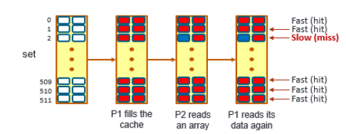
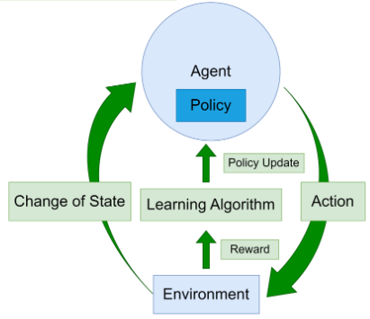

### Training the gym environment using an RL framework (RLMeta)

Now that we have shown how an gym environment is constructed, we need to train an RL agent to interact with the environment. There are many existing RL frameworks that are compatible with the standard gym environment, here are some notable examples:

* [TorchRL](https://pytorch.org/rl/), torchRL is part of the famous pytorch framework, development lead by Vincent Moens from Meta.
* [RLLib/Ray](https://docs.ray.io/en/latest/rllib/index.html), RLLib/Ray is an open-source RL library for distributed workloads, useful with multi-agent setting. 
* [Rlmeta](https://github.com/facebookresearch/rlmeta), also developed by Meta.

These frameworks have their individual strengths. However, for the cache guessing game, all of them works for this purpose. We use RLMeta as the example. For RLMeta, the related script are located in ```src/rlmeta/```. 

### Before Moving Forward, A Quick Refresher

###Prime Probe Overview
The Prime and Probe attack is another effective side-channel technique used to infer activities of other processes through shared resources, such as CPU caches. This method exploits the behavior of the cache to gather information about a victim's actions, particularly useful in environments where different processes or virtual machines share physical hardware resources.


### Steps of the Prime and Probe Attack

1. **Prime**:
   - **Action**: The attacker fills the cache with their own data, effectively 'priming' the cache.
   - **Method**: This involves accessing a set of memory locations that map to specific cache lines intended to be monitored. The goal is to ensure that these cache lines are filled with the attacker's data, displacing any previously held data by the victim.

2. **Probe**:
   - **Action**: After a certain period during which the victim's process is allowed to execute, the attacker re-accesses the same set of memory locations.
   - **Observation**:
     - **Fast Access**: If the data is accessed quickly, it suggests that the cache lines primed earlier were not displaced by the victim, indicating little or no activity by the victim on these cache lines.
     - **Slow Access**: If the re-access is slow (indicating a cache miss), it suggests that the victim's process has accessed memory that maps to the same cache lines, displacing the attacker's data.
    
<div align="center">
  
</div>

## Reinforcement Learning (RL) Overview

Reinforcement Learning is a type of machine learning where an agent learns to make decisions by interacting with an environment. Through this interaction, the agent learns to achieve a goal in a complex, uncertain environment.

<div align="center">
  
</div>

### Key Components of RL

1. **Environment**:
   - The **environment** represents the world through which the agent moves, providing states and feedback to the agent's actions. It is typically modeled as a Markov Decision Process (MDP).

2. **Agent**:
   - The **agent** makes decisions or takes actions based on its observations, aiming to maximize the cumulative reward. It learns from the consequences of its actions.

3. **Actions**:
   - **Actions** are the set of all possible moves or decisions the agent can make in a given state. The choice of action affects the agent's future state and the reward received.

4. **Observations**:
   - **Observations** are pieces of information that the agent receives at each time step about the current state of the environment. This can be a partial or full view depending on the environment.

5. **Rewards**:
   - A **reward** is immediate feedback provided by the environment in response to an action taken by the agent. The agent's objective is to maximize the total reward it receives over time.

6. **Learning Algorithm**:
   - The **learning algorithm** updates the agent's knowledge or policy based on the latest actions and the corresponding rewards. Popular algorithms include Q-learning, Deep Q-Networks (DQN), and Policy Gradient methods.

7. **Policy**:
   - A **policy** is a strategy used by the agent to decide the next action based on the current state. It can be deterministic or stochastic.

8. **State Transition**:
   - **State Transition** defines how the next state of the environment is affected by the current state and the action taken by the agent. This transition follows the dynamics of the environment, which are usually modelled as a probability distribution in the case of stochastic environments.

### Train the RL agent using RLMeta

[```src/rlmeta/train_ppo_attack.py```]([https://github.com/ut-ldma/lab/blob/main/src/rlmeta/train_ppo_attack.py](https://github.com/ut-ldma/lab/blob/main/src/rlmeta/train_ppo_attack.py)) is the script for training. The default configuration for training is specified in [```src/rlmeta/config/ppo_attack.yaml```](https://github.com/ut-ldma/lab/blob/main/src/rlmeta/config/ppo_attack.yaml). The environment configuration is specified in [```src/torchrl/config/env_config/```](https://github.com/ut-ldma/lab/blob/main/src/rlmeta/config/env_config) and the model configuration of the policy net is specified in 
[```src/rlmeta/config/model_config/```](https://github.com/ut-ldma/lab/blob/main/src/rlmeta/config/model_config).

Please use the following to launch the training

```
python /lab/src/rlmeta/train_ppo_attack.py env_config=hpca_ae_exp_4_1
```

select (2) when prompted to plot all the training progress in wandb. 

On your browser, open a new tab and open ```https://wandb.ai``` and navigate to the ```rl4cache``` project, where you can see the current training and testing return and other statistics. As the training goes, the return will gradually increase to a positive value close to 1.0, which indicates that the RL agent (attacker) will be able to guess the secret with high accuracy. (Since the correct guess reward is 1.0 and wrong guess reward is -1.0, only if most of the guesses are correct will the reward be close to 1.0). The script will also automatically save the checkpoint of the model of the policy net in ```src/rlmeta/output``` directory.

### Sampling the policy net to get the attack trajectory using RLMeta

Once we have trained the policy net to have very high guess correct rate, we want to get a sample of the attack trajectory generated by this policy net, this can be done using the following command.

```
python /lab/src/rlmeta/sampling_trajectories.py --saved_path=saved_ppo_attack-exp0 --num-rollouts=1
```
Which it will generate the attack sequence.


