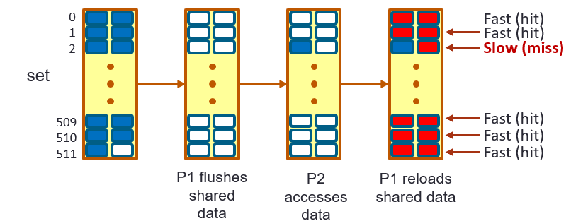

### Flush + Reload Cache Timing Attacks

The gym environment described in Part 1 does not include the flush instruction in the environment, as a result, it will
not be able to find flush+reload attacks commonly used. Even though the cache simulator has the interface for flush instruction,
the gym environment did not expose the flush to the ```action_space()```, in this excercise, we aim at extending the gym environment to incorporate the flush action into the gym environment. We directly modify the [```src/cache_guessing_game_env_impl.py```](https://github.com/rl4cas/lab/blob/main/src/cache_guessing_game_env_impl.py).

We use a flag [```flush_inst```](https://github.com/rl4cas/lab/blob/main/src/cache_guessing_game_env_impl.py#L100) to indicate whether we want to include flush instruction for the attacker, by default it is not enabled.

### Quick Refresher on Flush + Reload Cache Timing Attacks

## Flush+Reload Attack Summary

The Flush+Reload technique is a side-channel attack that exploits shared cache memory to infer activities of other processes on the same system. This technique involves two primary steps within the cache simulator:

### Steps of the Flush+Reload Attack

1. **Flush**:
   - **Action**: The attacker forcibly removes (flushes) a target line of memory from the cache.
   - **Method**: This is achieved using the `clflush` method in the cache simulator, where a specific address is cleared out of the cache memory.

2. **Reload**:
   - **Action**: The attacker then accesses the same memory address.
   - **Observation**:
     - **Fast Access**: If the data is accessed quickly, it suggests that the data was reloaded into the cache by the victim's process, indicating that the victim accessed the same data after it was flushed. This results in a cache hit.
     - **Slow Access**: If the data access is slow, it indicates a cache miss, suggesting the data was not used by the victim after the flush.




###
###
###
### Modify the ```action_space``` to Incorporate Flush Action

First, the original [```action_space```](https://github.com/rl4cas/lab/blob/main/src/cache_guessing_game_env_impl.py#L172) does not include the encodings for flush action, we need to extend the size of the action_space to include necessary encoding for flushing different attacker addresses, this is defined [here](https://github.com/rl4cas/lab/blob/main/src/cache_guessing_game_env_impl.py#L177).

### Modify the Action Parser ```parse_action()``` 

Second, after we increase the action space size, we still need to decode/parse the action so that we know which encoding corresponds to flushing which address. This is defined [here](https://github.com/rl4cas/lab/blob/main/src/cache_guessing_game_env_impl.py#L441). Once [```is_flush```](https://github.com/rl4cas/lab/blob/main/src/cache_guessing_game_env_impl.py#L446) is set 1, it means the action correspond to a flush instruction which flushes the [address](https://github.com/rl4cas/lab/blob/main/src/cache_guessing_game_env_impl.py#L445).

### Perform the Flush Instruction in ```step()```

Finally, even if we know what the action means, we still need to actually invoke proper [cache simulator's API](https://github.com/rl4cas/lab/blob/main/src/cache_guessing_game_env_impl.py) in the [```step()```](https://github.com/rl4cas/lab/blob/main/src/cache_guessing_game_env_impl.py?plain=1#L204) of the cache environment. This is an coding exercise, please fill in the proper API [here](https://github.com/rl4cas/lab/blob/main/src/cache_guessing_game_env_impl.py?plain=1#L295).

### Train the Modified Env to Explore Flush+Reload Attack

Once the flush instruction is included, please use the following command to launch the training.

Go to torchrl directory.
```
(py38) $ cd /lab/src/rlmeta
```

Please use the following to launch the training (```hpca_ae_exp_4_3``` is a configuration that require flush instruction.)

```
(py38) $ python /lab/src/rlmeta/train_ppo_attack.py env_config=hpca_ae_exp_4_3
```

Once the return is close to 1, please use the following to sample the attack.

```
(py38) $ python /lab/src/rlmeta/sampling_attack.py
```
Which it will generate the attack sequence.
